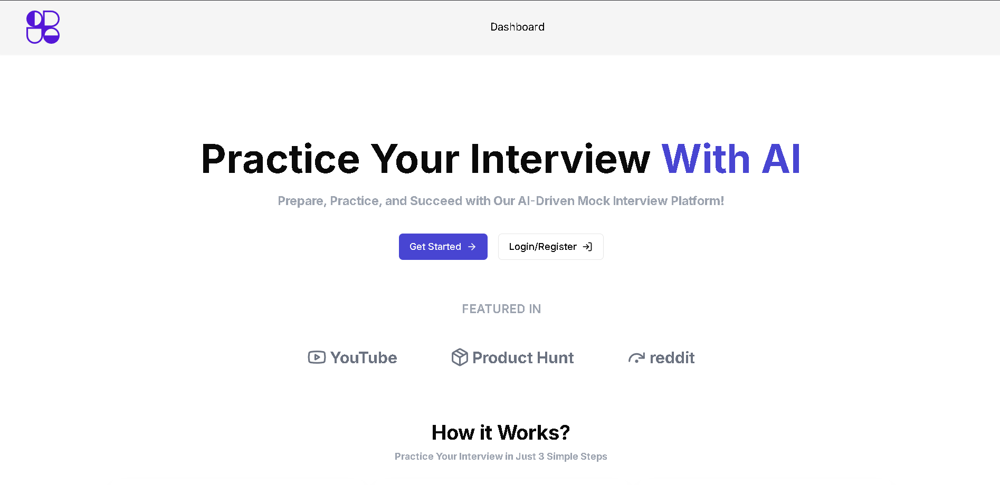
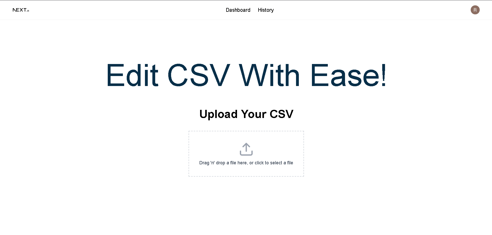
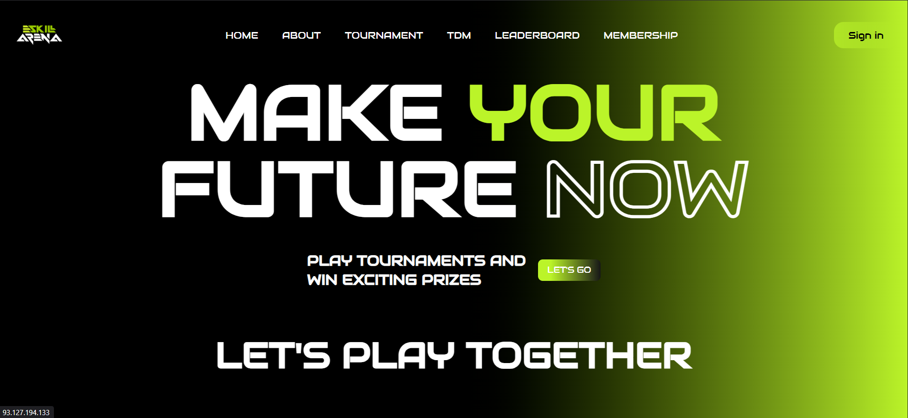
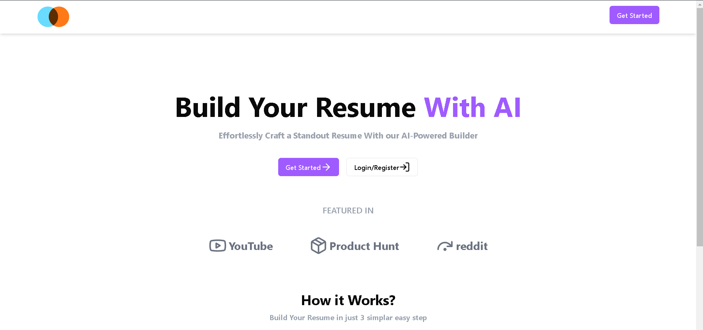
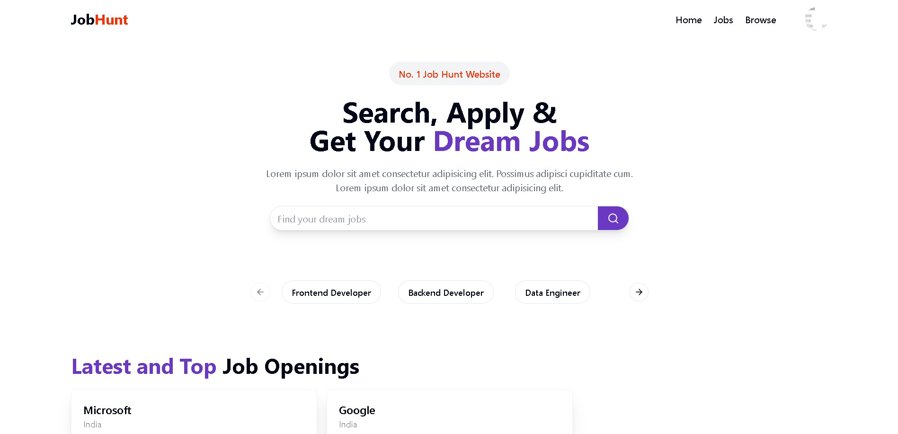

# 🌟 My Animated Portfolio

Welcome to my personal portfolio website! A modern, interactive showcase built with React, Three.js, and smooth animations.


## 🎯 About This Portfolio

This is my personal portfolio website featuring:
- ✨ **Smooth Animations** - Powered by GSAP
- 🌍 **3D Planet** - Interactive Three.js elements  
- 📱 **Fully Responsive** - Looks great on all devices
- 🎨 **Modern Design** - Clean and professional aesthetic

## � Portfolio Showcase

### Hero Section

*Interactive 3D planet with animated text and smooth scrolling*

### Featured Projects

#### 🚀 **AI Interview Platform**

*AI-powered mock interview platform with personalized feedback*

#### 📊 **CSV Editor** 

*Dynamic CSV management platform with cloud storage*

#### 🎯 **Skill Arena**

*Interactive skill assessment and learning platform*

#### 📄 **AI Resume Builder**

*Smart resume builder with AI-powered suggestions*

#### 💼 **Job Portal**

*Full-stack job portal connecting students with employers*

## � Quick Start

```bash
# Clone the repository
git clone https://github.com/rohit-jsfreaky/animated_portfolio.git

# Install dependencies
npm install

# Start development server
npm run dev
```

## � Connect With Me

- **Portfolio**: [Live Demo](https://your-portfolio-url.com)
- **GitHub**: [rohit-jsfreaky](https://github.com/rohit-jsfreaky)
- **LinkedIn**: [Rohit Kumar Kashyap](https://linkedin.com/in/rohit-kumar-kashyap)
- **Email**: rohitkashyap5673@gmail.com

---

⭐ **Star this repository if you like it!**

Made with ❤️ by **Rohit Kumar Kashyap**
